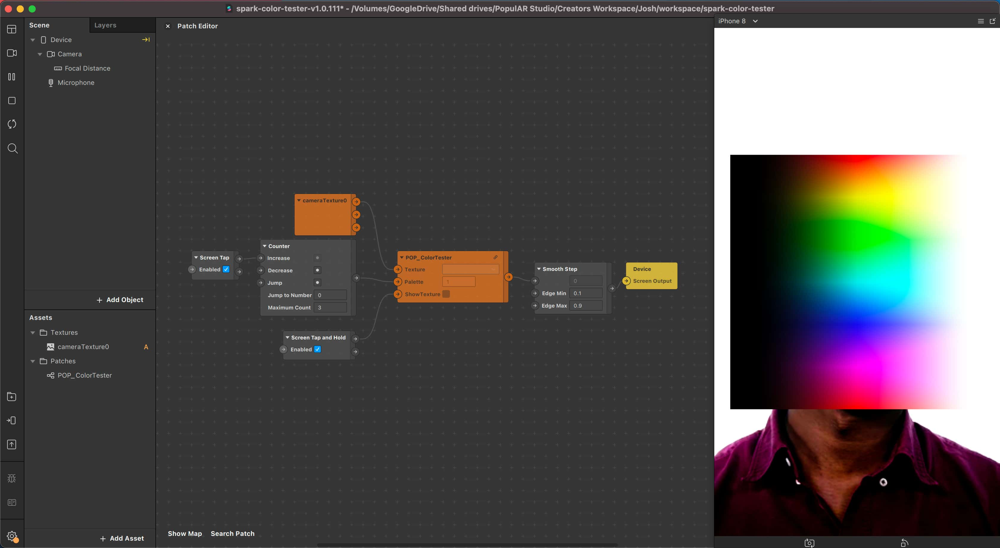

## POP_ColorTester

**PopulAR's utility patch for testing color adjustments in Spark AR.**

[Download project](https://github.com/Popul-AR/spark-color-tester/archive/refs/heads/master.zip)

Includes 3 test palettes: HSV, HSL, and grayscale.
